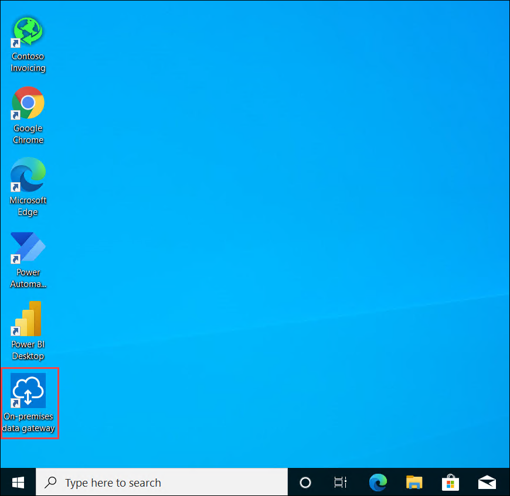
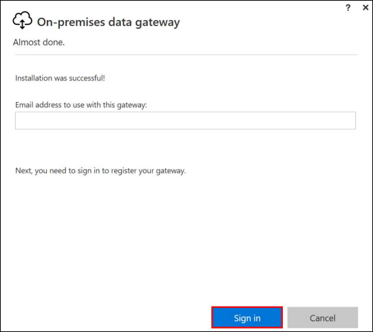

# Lab 10 – Run the scenario in unattended mode

## Exercise 1: Basic Desktop Flow in Unattended mode:

1. Navigate to ``https://admin.powerplatform.microsoft.com/``.
1. Click on **Resources** from the menu and select **capacity**.

   
  
1. On the Summary tab, scroll down and select **manage** under **add-ons**.

   
   
1. Select your **environment** from the drop down.

   
   
1. Under **Power automate unattended RPA**, **Change** the value to **1** and click on **save**.

   
   
3. If your remote VM has no **Excel** installed, you should disable both subflows from your **desktop flow** before you run them on the **remote VMs**.

   

4. Start the **VM1-{Suffix}**, if it's in a deallocated state from the **resources** tab of the environment.
   
   
   
1. From the **VM-{Suffix}**, In the search bar, **Search** for **RDP** and **select** the **Remote Connection Desktop** app.
   
   
   
   > **Note** :  You will RDP into the VM1 from the JumpVM(integrated VM) provided in the environment.    
   
1. From the **Environment details** tab, Copy the **VM1 DNS Name**.

   
  
1. Paste the **VM1 DNS Name** in the **Computer** field and click on **Connect**.
   
   

1. Click on **More choices**.

   
   
1. Now, click on the **Use a different account**. Now, enter the VM1 **username** and **password** which you have copied from **Environment details** page and click on **Ok** button. 
   Please add **dot** and **back-slash** “.\” before the username.

   

1. Next, click on the **Yes** button to accept the certificate and add in trusted certificates.

   
   
1. Now from the **VM1-{Suffix}**, In the **Search bar**, Search for **On-premise data gateway** and **open** the app.
 
   
   
1. Sign into the **gateway** using the same account that you created in lab 1 (the one you use to sign in Power Automate portal).

    
   
1. Select **Register a new gateway on this computer**, then click **Next**.

   

1. **Name** the gateway **Test on VM gateway**. **Create** a recovery key. Then **click** Configure.

   
   
1. Click **Close**.

   
   
1. Now from your personal computer open your preferred browser and navigate to ``flow.microsoft.com`` and login with the credentials provided under the **environment details** page.

   

1. Go to **My flows > Cloud flows**.

   

1. Click **+New flow > Instant cloud flow**.

   
   
1. Name the flow as **Manual trigger Desktop flow to enter invoice on VM**, select **Manually trigger a flow**. Then click **Create**.

   
   
1. Click on **+New step**.

   
   
1. Search for **Desktop flows** and select **Run** a flow built with Power Automate Desktop.

   
   
1. Click on the **three dots** and select **Add new connection**.

   
   
1. Select **Test on VM gateway** in the Gateway name field, enter username (e.g. VM1-Suffix\demouser) and password, Which can be found under the environment details page. Then click on **Create**

   
   
1. Select **Enter an invoice** Desktop flow.

   
   
1. Fill the box with these values:
   - **Run Mode**: Unattended -Runs in the background without signing in
   - **Amount**: $200
   - **Contact**: b.friday@wingtiptoys.com 
   - **Account**: WingTip Toys 

   Then click on **save**.
   
   

1. Prepare to test unattended flow. Make sure your VM is in good state. Log in into the **VM1-{Suffix}** and Review the steps below: 
   - search **gateway** in VM windows search bar. Select **On-premises data gateway**.
   
   
   
   - Click **Sign in**.

   
   
   - Sign into the **gateway** using the same account that you created in lab 1 (the one you use to sign in Power Automate portal).

   
   
   - Now you can see your gateway is **online and ready** to be used, click Close.

   
   
   - **Open** Contoso invoicing app, go to **Invoice** tab, and write down what is the current highest invoice ID number. This is to prepare for the comparison with the new IDs after the unattended run.

   
   
   - **Log off** your **VM1-{Suffix}** and the JumpVM **VM-{Suffix}**.

   

   > **Note** : Please note that you must logoff from both the VM's for the Flow to run successfully and need to perform the next part from your own computer.

   - Now from the **portal** in your own computer, you will see the gateway is online as well under **Data->Gateway**.
   
   
   
1. Now from the **portal** in your own computer, Click on **test**.
  
   
         
1. Select **I’ll perform the trigger action**. Click on **test**.
 
   
   
1. Click **Continue**.

   
   
1. Click **Run flow**

   
   
1. Click **Done**

   
   
1. The flow will be running unattended on the VM that you have logged off. You can monitor the flow run from the portal run history. It should run successfully.

   > **Tip** : If the installation location paths (e.g. C:\Program Files (x86)\Contoso, Inc\Contoso Invoicing\LegacyInvoicingApp.exe) are different for the Contoso app on the machine at recording time vs the VM used for playback time, you will have to either modify the path manually from the portal script steps, or uninstall/reinstall the Contoso app on the VM to the same path, or simply delete the script and re-record the Desktop flow on the VM again to pick up the correct path.

1. You can log back into the VM and write down the Contoso app newest invoice ID.
   
## Exercise 2: End-to-end Invoice Processing Scenario in Unattended mode

1. Now we will update the E2E invoicing process flow to be run unattended. Now from the portal go to 
**Solutions**. Select **Invoice processing solution** (the one you created in lab 7).

   

1. Open Enter **invoice information flow** (the one you created in lab 7).

   
   
1. Click **Edit**

   

1. Expand **When a new email arrives** step.

   
   
1. Click **Show advanced options**.

   
   
1. Type in **unattended** in Subject Filter field.

   
   
1. Expand **Run a flow built with Power Automate Desktop**.

   
   
1. Select the ellipsis icon (…) for **Run a flow built with Power Automate Desktop** action 
and select the correct unattended connection that you created in exercise 1 of lab 10.

1. Select **Unattended – Runs in the background without signing in** in **Run Mode** field.

   
   
1. Click **Save**.

   
   
1. Make sure your VM is ready for unattended run. E.g. make sure VM is running, gateway 
on VM is online (by checking on the portal under Data->gateway), write down the 
highest invoice ID number, logged off the VMs using logoff command.

1. Now prepare to trigger this flow. In a separate tab, open the **Teams** app (open it in the 
browser, not the app).

1. In another separate tab, open the Office 365 Outlook app.

1. Compose a new email with the following settings:
    - **To**: {email address of the user identity you are using in this lab}
    - **Subject**: **unattended**
    - **Attachments**: **newinvoice.jpg** (from the lab resource files)

1. Send the email and wait for the flow to be triggered to run.

1. Wait for an approval request message to you in the Teams tab - approve the invoice.

1. In the Outlook tab, wait for a confirmation email that indicates the approval is complete.

   
   
1. Log in back to **VM1-{suffix}** to check the new added entry after your flow ran successfully.

1. Open **Contoso Invoicing** app on **VM1-{suffix}**.

   
   
1. Click **Invoices**. And you can find the new entries here from the unattended runs. Notice 
the ID increased compared to the number you write down earlier

   

## Exercise 3: Run unattended on a cluster of 2 VMs

1. We already have 1 VM used in exercise 1 and 2 in this lab 10. Now we will add one more 
VM to make these 2 VMs to form a cluster.

1. Start the **VM2-{Suffix}**, if it's in a deallocated state from the **resources** tab of the environment.

